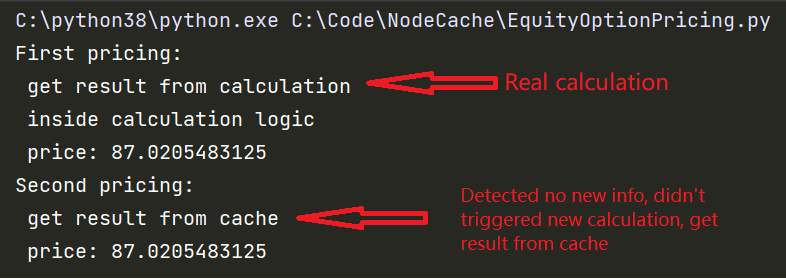

## Dependency Graphs Prototype

### The idea behind Dependency Graphs is that in intra-day trading, there are tons of calculation and the whole calibration/calculation is time-consuming, and when market changes, if we re-run the whole calculation, it could take time and therefore is hard for trader/PM to get live risk feedback.

### Dependency Graphs is a way to solve this problem, it is a directed acyclic graph, where each node represents a calculation, and each edge represents a dependency between two calculations. When market changes, we only need to re-run the calculation that is affected by the market change, and the rest of the calculation will be cached and reused.

### Node Cache repo implemented a prototype for Dependency Graphs, user could try run EquityOptionPricing.py.

## Example

